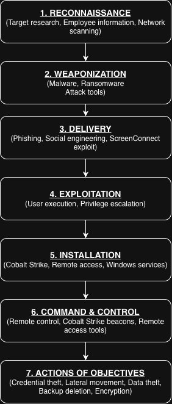

# Week 4 - Cyber Kill Chain Analysis: Black Basta

**Project:** CTI Investigation of the Black Basta Ransomware Attack Chain
**Authors:** Botakoz Berikkyzy, Timur Aktayev, Alina Ashirova

1) Introduction

The Cyber Kill Chain is a model developed by Lockheed Martin to describe the main stages of a cyberattack. 
It divides an attack into seven stages: Reconnaissance, Weaponization, Delivery, Exploitation, Installation, Command and Control, and Actions on Objectives.
In this work, the model is used to analyze the Black Basta ransomware attack chain. The Cyber Kill Chain shows the order of the attack, while MITRE ATT&CK provides more detailed techniques that describe how the attackers performed specific actions.

2) Attack Stage by Stage

- Stage 1 - Reconnaissance

Black Basta attackers had to identify useful targets and find ways to reach their networks. Their later activities included network scanning and the use of employee contacts during social engineering campaigns. The CISA advisory gives limited information about the attackers' reconnaissance before the initial compromise, so some activities at this stage are treated as inferred rather than confirmed.

**ATT&CK:**

* T1595 - Active Scanning — inferred
* T1589 - Gather Victim Identity Information — inferred

**Source:** CISA AA24-131A; MITRE ATT&CK

- Stage 2 - Weaponization

At this stage, the attackers prepared the tools and malware needed for the operation. The Black Basta ecosystem included ransomware, Cobalt Strike, and other tools used during intrusion and lateral movement. However, the available advisory mainly describes activity after the attackers reached the victim environment, so specific weaponization activities are not fully documented.

**ATT&CK:**

* T1588.002 - Obtain Capabilities: Tool — inferred
* T1587.001 - Develop Capabilities: Malware — inferred

**Source:** CISA AA24-131A; MITRE ATT&CK

- Stage 3 - Delivery

Black Basta affiliates used several methods to obtain initial access. These included spearphishing emails, Microsoft Teams calls used for social engineering, and exploitation of the ConnectWise ScreenConnect vulnerability CVE-2024-1709. The CISA advisory also reports the use of valid credentials in some cases.

**ATT&CK:**

* T1566 - Phishing — confirmed
* T1566.004 - Phishing: Spearphishing Voice — confirmed
* T1190 - Exploit Public-Facing Application — confirmed
* T1078 - Valid Accounts — confirmed

**Source:** CISA AA24-131A

- Stage 4 - Exploitation

After delivery or initial access, the attackers could execute malicious content or exploit vulnerabilities to obtain higher privileges. CISA reports the use of CVE-2024-1709 for initial access and the use of vulnerabilities such as Zerologon, NoPac, and PrintNightmare for privilege escalation. Black Basta-related activity also includes malicious file execution.

**ATT&CK:**

* T1204.002 - User Execution: Malicious File — confirmed for Black Basta
* T1068 - Exploitation for Privilege Escalation — confirmed

**Source:** CISA AA24-131A; MITRE ATT&CK

- Stage 5 - Installation

After gaining access, the attackers used remote access and other tools to maintain control and continue their operations inside the victim network. CISA reports the use of ScreenConnect, Splashtop, and Cobalt Strike beacons for remote access and lateral movement. Black Basta is also documented by MITRE as being able to create Windows services for persistence.

**ATT&CK:**

* T1219 - Remote Access Software — confirmed for the remote access activity
* T1543.003 - Create or Modify System Process: Windows Service — confirmed for Black Basta

**Source:** CISA AA24-131A; MITRE ATT&CK

- Stage 6 - Command and Control

Command and Control allowed the attackers to interact with compromised systems and continue their activity remotely. Cobalt Strike beacons and remote access software were used to support remote access and lateral movement. This stage connects the compromised systems with attacker-controlled infrastructure.

**ATT&CK:**

* T1219 - Remote Access Software — confirmed
* C2 technique depends on the specific communication method used; no additional C2 technique is assigned here without sufficient evidence.

**Source:** CISA AA24-131A; MITRE ATT&CK

- Stage 7 - Actions on Objectives

This was the largest stage of the Black Basta attack chain. After gaining and expanding access, the attackers performed discovery, credential access, lateral movement, data theft, recovery inhibition, and ransomware deployment.

The activity included network scanning, credential theft using tools such as Mimikatz, movement with PsExec and RDP, data transfer using tools such as Rclone, deletion of shadow copies with vssadmin, and file encryption.

**ATT&CK:**

* T1003 - OS Credential Dumping — confirmed where applicable to the observed credential-dumping activity
* T1021.001 - Remote Services: Remote Desktop Protocol — confirmed for RDP activity
* T1569.002 - System Services: Service Execution — relevant to PsExec
* T1562.001 - Impair Defenses: Disable or Modify Tools — confirmed
* T1490 - Inhibit System Recovery — confirmed
* T1486 - Data Encrypted for Impact — confirmed

**Source:** CISA AA24-131A; MITRE ATT&CK

- 3. Summary Table

| Stage                    | What Black Basta did                                                                                | ATT&CK techniques                                    |
| ------------------------ | --------------------------------------------------------------------------------------------------- | ---------------------------------------------------- |
| 1. Reconnaissance        | Target research, employee information and network scanning                                          | T1595, T1589 - inferred                              |
| 2. Weaponization         | Prepared malware and attack tools                                                                   | T1588.002, T1587.001 - inferred                      |
| 3. Delivery              | Phishing, Teams social engineering and exploitation of ScreenConnect                                | T1566, T1566.004, T1190, T1078                       |
| 4. Exploitation          | Malicious file execution and privilege escalation                                                   | T1204.002, T1068                                     |
| 5. Installation          | Remote access tools and persistence mechanisms                                                      | T1219, T1543.003                                     |
| 6. Command and Control   | Remote interaction with compromised systems                                                         | T1219                                                |
| 7. Actions on Objectives | Credential access, lateral movement, defense evasion, data transfer, backup deletion and encryption | T1003, T1021.001, T1569.002, T1562.001, T1490, T1486 |

- 4. Kill Chain Diagram

The diagram shows the seven stages of the Cyber Kill Chain and the main Black Basta activities associated with each stage.

- 5. How to Break the Chain

| Stage                 | Defense against Black Basta                                                            | Action  |
| --------------------- | -------------------------------------------------------------------------------------- | ------- |
| Reconnaissance        | Monitor exposed services and suspicious scanning activity                              | Detect  |
| Weaponization         | Use threat intelligence to identify known malware and attacker tools                   | Detect  |
| Delivery              | Use phishing protection and restrict unexpected external communication                 | Deny    |
| Exploitation          | Patch public-facing software such as ScreenConnect and apply security updates quickly  | Deny    |
| Installation          | Use EDR and monitor unauthorized remote-access software and services                   | Disrupt |
| Command and Control   | Monitor suspicious remote connections and block known malicious infrastructure         | Disrupt |
| Actions on Objectives | Maintain offline backups, monitor large data transfers, and detect ransomware behavior | Degrade |

The Lockheed Martin model emphasizes that defenders can act at different points of the attack chain. For Black Basta, preventing initial access or exploitation can reduce the possibility of later lateral movement, data theft, and encryption.

- 6. Conclusion

The Black Basta case shows how the Cyber Kill Chain can be used to describe an attack as a sequence of connected stages. Early stages such as reconnaissance and weaponization are less visible in the available Black Basta advisory, while delivery, exploitation, lateral movement, and impact are documented in more detail.

The main limitation of the Kill Chain is that many different activities are grouped into the final Actions on Objectives stage. MITRE ATT&CK provides more detail by separating these activities into individual tactics and techniques. Using both models together gives a clearer picture of how the Black Basta attack developed and where defenders can detect or disrupt it.

## Sources

1. CISA, #StopRansomware: Black Basta, AA24-131A.
2. MITRE ATT&CK, Black Basta (S1070).
3. Hutchins, E. M., Cloppert, M. J., and Amin, R. M., *Intelligence-Driven Computer Network Defense Informed by Analysis of Adversary Campaigns and Intrusion Kill Chains*, Lockheed Martin, 2011.
4. Week 1 - Threat Profile: Black Basta.
5. Week 4 lecture materials.
