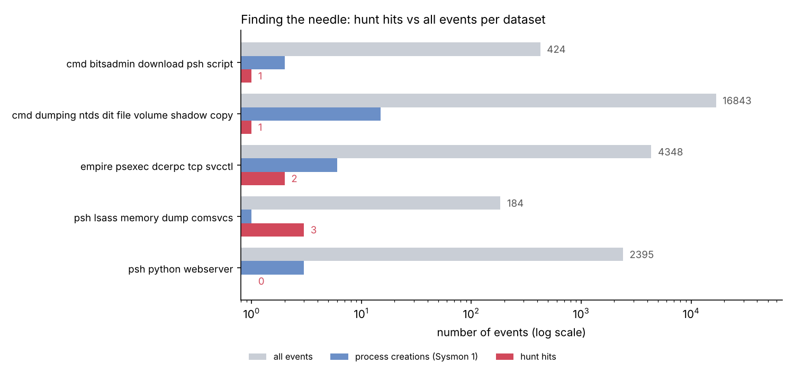

# Week 5 — Threat Hunting Concept (Assignment 3)

**Syllabus task:** Build a hypothesis-driven hunting scenario (e.g., suspicious PowerShell activity). Execute hunt queries in Splunk or ELK.

**Hunting model:** hypothesis-driven, with hypotheses built from our intelligence (Weeks 1–4).

| ID | Hypothesis: "If Black Basta is in our network, we may find…" | ATT&CK | Result |
|---|---|---|---|
| H1 | PowerShell with an encoded command / hidden window, started by an unusual parent | T1059.001, T1027.010 | **Confirmed:** remote service → hidden encoded PowerShell → AMSI bypass → C2 |
| H2 | Built-in tools downloading files (curl, bitsadmin, certutil, PowerShell), especially after Quick Assist | T1105, T1197, T1219.002 | **Partly:** bitsadmin found; second download only visible after decoding Base64; Quick Assist not in data |
| H3 | LSASS memory dumps and vssadmin shadow copy commands (our Week 1 hypothesis, updated) | T1003.001, T1003.003, T1490 | **Confirmed:** comsvcs MiniDump, LSASS access, vssadmin on a DC |

| File | What is inside |
|---|---|
| [report.md](report.md) | The assignment report |
| [data/](data/) | 5 public Windows attack datasets (OTRF Security-Datasets, MIT license), 24,194 events |
| [scripts/hunt.py](scripts/hunt.py) | Runs the 3 hunts, decodes PowerShell, pivots, writes results and chart |
| [queries/kibana_kql.md](queries/kibana_kql.md) | Hunt queries for Kibana (ELK) |
| [elk/](elk/) | Docker Compose for Elasticsearch + Kibana and the loader script |
| [results/](results/) | `findings.csv` and `hunt_results.md` (script output) |
| [images/](images/) | Chart and Kibana screenshots |

**Main result:** 24,194 events → 7 hits. The strongest finding is a PsExec-style remote service that starts hidden, encoded PowerShell, which disables logging and connects to a C2 server.

