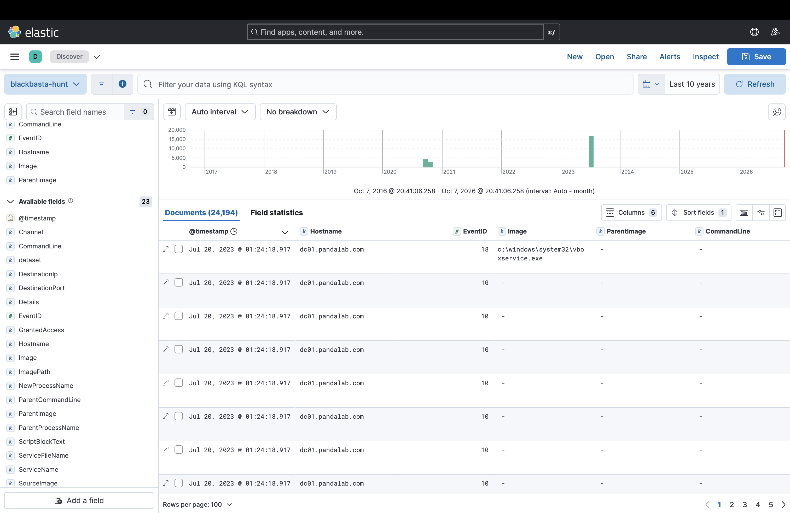
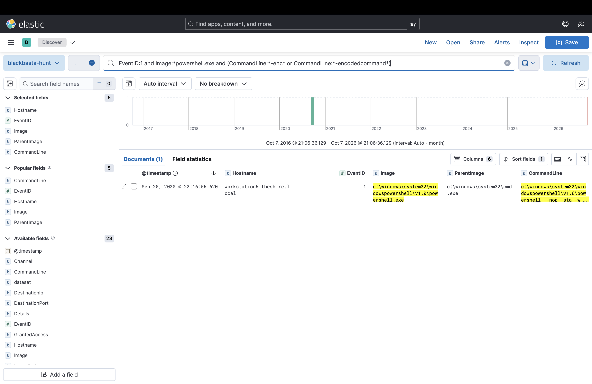
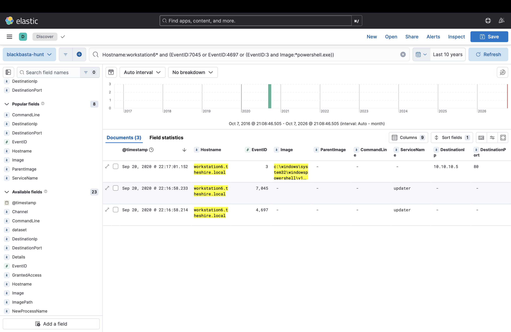
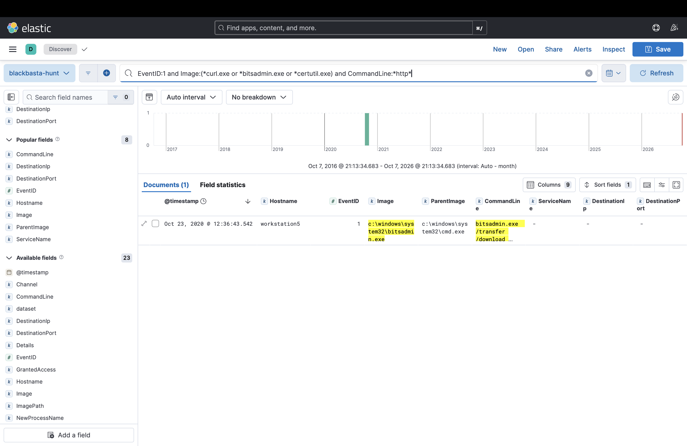
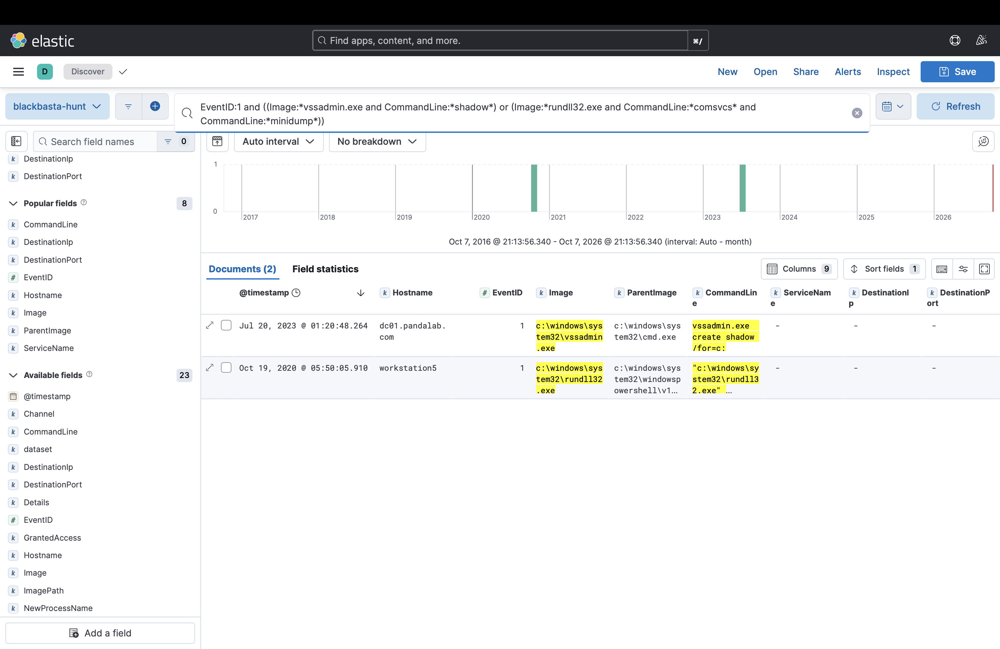
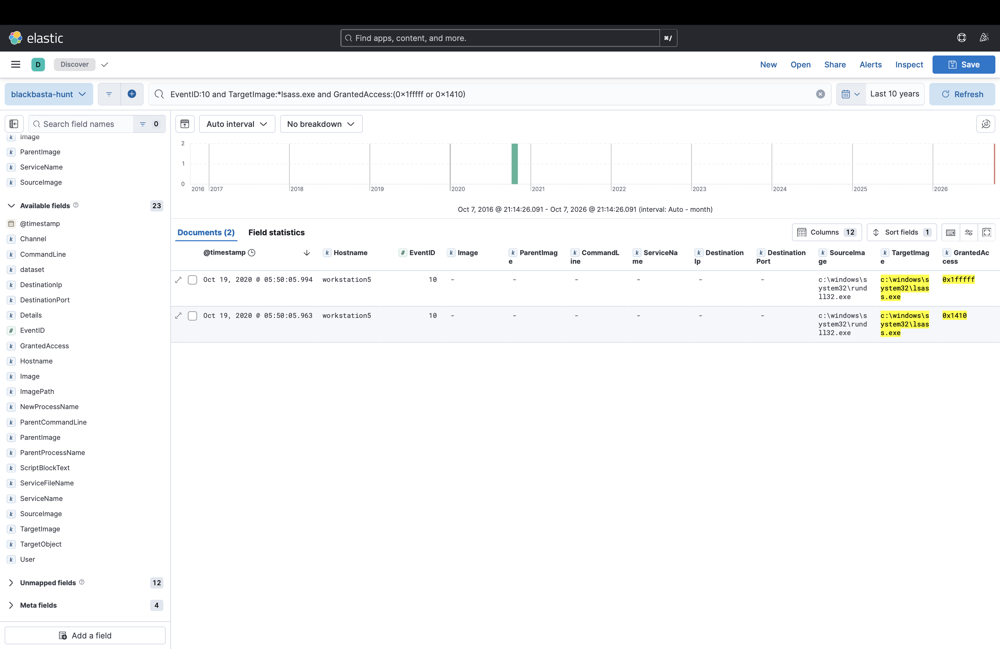

# Week 5 — Threat Hunting Concept (Assignment 3)

Project: CTI Investigation of the Black Basta Ransomware Attack Chain

Authors: Botakoz Berikkyzy, Alina Ashirova, Timur Aktayev

## 1. Goal

The syllabus tasks for week 5 are:

- *"Build a hypothesis-driven hunting scenario (e.g., suspicious PowerShell activity)."*
- *"Execute hunt queries in Splunk or ELK."*

In weeks 1–4 we collected intelligence about Black Basta and mapped a real attack to the Kill Chain and ATT&CK. This week we **use** that intelligence: we wrote 3 hunting hypotheses, turned them into queries for ELK (Kibana), and ran them on real Windows attack logs.

**Result in one sentence:** we searched 24,194 events and found 7 hits for our 3 hypotheses. The strongest finding is a hidden, encoded PowerShell started by a new remote service (the way PsExec works). It turns off security logging and connects to a C2 server. A normal keyword search **misses** the download inside this command; we found it only after decoding the Base64.

## 2. Threat hunting in short

**Threat hunting** means searching our own data for attackers who are **already inside** and were not caught by alerts. Alerts wait for something known to happen. A hunter starts from an idea and goes to look.

There are two main hunting models (syllabus, week 5: "Intel-driven, Hypothesis-driven"):

| Model | Starts from | Example |
|---|---|---|
| **Intel-driven** | IOCs and reports about a threat | "Search for the 21 Black Basta IOCs from CISA" (we did this in Weeks 2–3) |
| **Hypothesis-driven** | A testable idea about attacker **behavior** (TTPs) | "If Black Basta is here, we may see PowerShell with an encoded command started by a service" |

We combine both: our hypotheses come **from intelligence** (Weeks 1–4), but they describe **behavior**, not IOCs. In Week 2 we saw that Black Basta's IOCs change fast and many of its tools are normal software, so hashes and IPs are at the bottom of the Pyramid of Pain. TTPs are at the top.

We followed the classic hunting loop:

```
1. Create a hypothesis  →  2. Investigate with tools  →  3. Uncover patterns & TTPs  →  4. Inform & enrich (new detections)  →  back to 1
   (section 3)                (sections 4–5)                (section 6)                    (section 7)
```

A good hypothesis is **testable**: it says what we expect to see, in which data, and it can be proven true or false.

## 3. Our hypotheses

Each hypothesis covers a different part of the Kill Chain from Week 4, so together they give several chances to catch the attack.

| ID | Hypothesis: "If Black Basta / Storm-1811 is in our network, we may find…" | Kill Chain stage (Week 4) | ATT&CK | Data source | Why we expect it (intel) |
|---|---|---|---|---|---|
| **H1** | …**PowerShell with an encoded command or a hidden window**, started by `cmd.exe`, `services.exe` or another unusual parent | 4–6 Exploitation, Installation, C2 | T1059.001 PowerShell, T1027.010 Command Obfuscation, T1569.002 Service Execution | Sysmon 1, Security 4688; pivot: 7045, 4697, Sysmon 3 | Qakbot and Cobalt Strike start PowerShell like this; Black Basta uses PsExec, which creates a service (CISA AA24-131A, Microsoft) |
| **H2** | …**built-in Windows tools downloading files** (`curl`, `bitsadmin`, `certutil`, PowerShell web client), especially soon after **Quick Assist** started on the same host | 4–5 Exploitation, Installation | T1105 Ingress Tool Transfer, T1197 BITS Jobs, T1219.002 Remote Desktop Software | Sysmon 1 | Storm-1811 used `curl` to download batch files right after a Quick Assist session (Microsoft, Rapid7); Black Basta uses BITSAdmin (CISA) |
| **H3** | …**credential theft and backup tampering**: LSASS memory dumps and `vssadmin` shadow copy commands | 7 Actions on Objectives | T1003.001 LSASS Memory, T1003.003 NTDS, T1490 Inhibit System Recovery | Sysmon 1, Sysmon 10 (process access) | Black Basta dumps LSASS with Mimikatz and runs `vssadmin delete shadows /all /quiet` (CISA) |

**H3 is our Week 1 hypothesis, updated.** In Week 1 we only looked for `vssadmin delete shadows`. In Week 4 we saw that this is the very last step before encryption. So we made the hypothesis wider: any `vssadmin … shadow` command, plus credential theft, which happens earlier.

All technique IDs were checked against the current MITRE ATT&CK data (mitre/cti on GitHub, 7 October 2026). None is revoked. (T1562.001, which we used in Week 1, is revoked; the new ID is **T1685** Disable or Modify Tools.)

## 4. Data

We do not have logs from a real Black Basta victim. Real incident logs are private. So we used **OTRF Security-Datasets** (Open Threat Research Forge, MIT license): recordings of real attack techniques run in a Windows lab, with Sysmon, Security and PowerShell logs. We chose 5 datasets that match Black Basta TTPs from our intel:

| Dataset (in [`data/`](data/)) | What was done in the lab | Black Basta link | Events |
|---|---|---|---|
| `empire_psexec_dcerpc_tcp_svcctl` | Lateral movement: remote service starts an encoded PowerShell agent (Empire) | PsExec / remote services, PowerShell, C2 | 4,348 |
| `cmd_bitsadmin_download_psh_script` | `bitsadmin` downloads a file from the internet | BITSAdmin (CISA) | 424 |
| `psh_lsass_memory_dump_comsvcs` | LSASS memory dump with `rundll32 comsvcs.dll MiniDump` | Credential dumping from LSASS | 184 |
| `cmd_dumping_ntds_dit_file_volume_shadow_copy` | `vssadmin create shadow` on a domain controller to copy NTDS.dit | vssadmin, domain credential theft | 16,843 |
| `psh_python_webserver` | PowerShell starts a Python web server | **Control set**: no Black Basta TTP, hunts should stay quiet | 2,395 |
| **Total** | | | **24,194** |

Most events are normal background noise (DLL loads, registry, process access). Only 27 events are process creations. This is like a real network: the attack is a few lines among thousands.

## 5. Tools and queries

| Tool | What we used it for | Files |
|---|---|---|
| **ELK (Elasticsearch + Kibana 8.15)** in Docker | Load the logs, run the hunts as **KQL** in Kibana Discover | [`elk/docker-compose.yml`](elk/docker-compose.yml), [`elk/load_to_elk.py`](elk/load_to_elk.py), [`queries/kibana_kql.md`](queries/kibana_kql.md) |
| **Python "mini SIEM"** | Same hunts as code, plus things KQL cannot do: decode Base64 PowerShell, time correlation (Quick Assist → curl), automatic pivots | [`scripts/hunt.py`](scripts/hunt.py) |

Example, the main KQL query for H1:

```
EventID:1 and Channel:"microsoft-windows-sysmon/operational" and Image:*powershell.exe
  and (CommandLine:*-enc* or CommandLine:*-encodedcommand* or (CommandLine:*-w*hidden* and CommandLine:*-nop*))
```

### Kibana screenshots

| Hunt | Screenshot |
|---|---|
| Data loaded (all 24,194 events) |  |
| H1 encoded PowerShell |  |
| H1 pivot: service + network |  |
| H2 download tools |  |
| H3 vssadmin + comsvcs |  |
| H3 LSASS access (Sysmon 10) |  |

## 6. Results


Output of [`scripts/hunt.py`](scripts/hunt.py) (full list in [`results/findings.csv`](results/findings.csv)):

| # | Hyp. | Host | Time (UTC) | Process ← parent | What we found | ATT&CK | Severity |
|---|---|---|---|---|---|---|---|
| 1 | H1 | WORKSTATION6 | 2020-09-20 16:16:56 | `powershell.exe` ← `cmd.exe` ← `services.exe` | Encoded command, hidden window, runs as SYSTEM | T1059.001, T1027.010 | high |
| 2 | H2 | WORKSTATION5 | 2020-10-23 06:36:43 | `bitsadmin.exe` ← `cmd.exe` | `bitsadmin /transfer` downloads a file from GitHub | T1197, T1105 | medium |
| 3 | H2 | WORKSTATION6 | 2020-09-20 16:16:56 | `powershell.exe` ← `cmd.exe` | `Net.WebClient` download — **only visible after decoding** hit #1 | T1105, T1071.001 | high |
| 4 | H3 | DC01 | 2023-07-19 19:20:48 | `vssadmin.exe` ← `cmd.exe` | `vssadmin create shadow /for=C:` on a domain controller | T1003.003 | high |
| 5 | H3 | WORKSTATION5 | 2020-10-18 23:50:05 | `rundll32.exe` ← `powershell.exe` | `comsvcs.dll MiniDump` of LSASS to a `.dmp` file in Temp | T1003.001, T1218.011 | critical |
| 6–7 | H3 | WORKSTATION5 | 2020-10-18 23:50:05 | `rundll32.exe` → `lsass.exe` | Sysmon 10: opens LSASS with access `0x1fffff` and `0x1410` | T1003.001 | high |

Every process hit (#1–5) is also visible in **Security 4688**. So the hunt still works if a company has no Sysmon, only Windows auditing with command line logging.

### H1 deep dive: the encoded PowerShell (hypothesis confirmed)

H1 found one event. We pivoted on the host and time (±5 minutes), as a hunter would:

1. **16:16:58** — user `pgustavo` logs on over the network (4624, logon type 3) from `172.18.39.5`, and a **new service "Updater"** is installed (7045 and 4697). The service command is `%COMSPEC% /C start /b powershell -noP -sta -w 1 -enc …`. This is exactly how PsExec-style lateral movement works: copy, create a service, start it. (Sysmon and Security logs differ by ~2 seconds; they use different clocks.)
2. `services.exe` → `cmd.exe` → `powershell.exe` runs as **NT AUTHORITY\SYSTEM** with `-noP` (no profile), `-w 1` (hidden window) and `-enc` (Base64 command).
3. We **decoded the Base64** (UTF-16LE). The script:
   - turns off **PowerShell Script Block Logging** and bypasses **AMSI** (so antivirus cannot scan it) → T1685 Disable or Modify Tools. It also splits words (`'Amsi'+'Utils'`) to hide them from keyword searches.
   - downloads the next stage with `Net.WebClient` from `http://10.10.10.5/news.php` with a fake browser User-Agent → T1071.001, T1105.
4. **Sysmon 3** confirms it: `powershell.exe` connects to `10.10.10.5:80`.

**Verdict:** true positive. In a real company this is an incident: an attacker already moved from one computer to another and has a C2 channel (Kill Chain stage 6).

### H2: download tools (partly confirmed)

- `bitsadmin /transfer` (hit #2) is the classic BITSAdmin download that CISA lists for Black Basta.
- Hit #3 is important: **the KQL query does not find it**, because the words `WebClient` and `http` are inside the Base64 text. Our script decodes `-enc` commands first, then searches. Lesson: obfuscation beats simple keyword search; hunters need decoding (or PowerShell Script Block Logging, EventID 4104, which logs the decoded script — but here the attacker turned it off).
- **Quick Assist → curl** (the Storm-1811 pattern): **0 results**, because Quick Assist does not appear in any public dataset. The query and the time correlation are ready (`hunt.py`), but they are **not tested on real data**. Absence of evidence is not evidence of absence.

### H3: credential theft and backups (confirmed, and Week 1 hypothesis improved)

- `rundll32 comsvcs.dll MiniDump` (hit #5) dumps LSASS memory, where Windows keeps passwords. Sysmon 10 shows the same attack from the other side (hits #6–7): `rundll32.exe` opens `lsass.exe` with full access.
- **Filtering matters:** there are **184** LSASS access events, but 150 of them are `vboxservice.exe` (a normal VirtualBox tool). Filtering by the access mask (`GrantedAccess` 0x1fffff, 0x1410…) leaves **2**. Without this filter the hunt would drown in noise.
- `vssadmin create shadow` on DC01 (hit #4): our **Week 1** query (`delete shadows`) would **miss** this. Attackers also use shadow copies to **steal** NTDS.dit (all domain password hashes). So the wider H3 query is better.

### Control set

The `psh_python_webserver` dataset (PowerShell starts Python) gave **0 hits**. Our queries do not fire just because PowerShell is used. This is a small test for false positives, not a proof: a real network has much more normal admin activity.

## 7. Inform & enrich: what we do with the results

| Result | Action |
|---|---|
| H1 confirmed | The H1 query can become a SIEM alert. Pivot steps (service install + network) written as a playbook in `kibana_kql.md` |
| Base64 hid the download from KQL | Turn on PowerShell Script Block Logging (4104) and protect it; hunt decoded text, not only the command line |
| H2 Quick Assist not testable | Next weeks (Atomic Red Team, week 9): run Quick Assist + `curl` in our own lab VM to create test data |
| H3: LSASS noise | Keep the access-mask filter and an allowlist of normal tools (antivirus, VirtualBox/VMware tools) |
| H3: vssadmin `create` | Updated our Week 1 hypothesis: the query now covers create and delete |
| New IOC: C2 `10.10.10.5/news.php` | Lab IP, not a real IOC — we do **not** add it to MISP. In a real hunt it would go to MISP as a new event |

## 8. Connection to previous weeks

- **Week 1:** the vssadmin hypothesis (T1490) became H3, and is now wider.
- **Week 2:** the data source mapping said Sysmon 1, 3, 10 and Windows 7045 are the key logs. This week we used exactly these.
- **Week 3:** MISP holds IOCs (intel-driven). This week is the TTP side (hypothesis-driven). Both are needed.
- **Week 4:** each hypothesis covers a Kill Chain stage: H2 → stages 4–5, H1 → stages 5–6, H3 → stage 7. Week 4 said stages 3–4 are the cheapest place to stop the attack; H2 (Quick Assist → curl) aims there, but we could not test it yet.

## 9. Limitations

- The data are **lab recordings of Black Basta techniques**, not logs of a real Black Basta attack. Hosts, users and the C2 IP (10.10.10.5) are lab values.
- The datasets are **small and short** (27 process creations). In a real company one day has millions of events, so false positives would be much higher, especially for `curl` and encoded PowerShell used by admin tools.
- Each dataset contains one attack, and we chose datasets that match our hypotheses. So hits are expected; the real test is the control set and real traffic.
- Quick Assist (H2) is not tested on data.

## 10. How to reproduce

**Python (no SIEM needed):**

```bash
cd week05/scripts
pip install matplotlib
python3 hunt.py          # writes results/findings.csv, results/hunt_results.md, images/hunt_funnel.png
```

Output of our run (7 October 2026):

```
Scanned 24194 events (27 process creations, 184 LSASS accesses)
  H1: 1 hits
  H2: 2 hits
  H3: 4 hits
```

**ELK (Kibana):**

```bash
cd week05/elk
docker compose up -d       # Elasticsearch + Kibana 8.15, wait 2 minutes
python3 load_to_elk.py     # loads 24,194 events into index "blackbasta-hunt"
```

Then open http://localhost:5601 → Stack Management → Data Views → create `blackbasta-hunt` (time field `@timestamp`) → Discover, time range "Last 10 years", and paste the queries from [`queries/kibana_kql.md`](queries/kibana_kql.md). Kibana shows local time (2020 events: UTC+6), the report uses UTC.

## 11. Sources

1. CISA AA24-131A — #StopRansomware: Black Basta: https://www.cisa.gov/news-events/cybersecurity-advisories/aa24-131a
2. Picus Security — Black Basta analysis (CISA AA24-131A): https://www.picussecurity.com/resource/blog/black-basta-ransomware-analysis-cisa-alert-aa24-131a
3. Microsoft Threat Intelligence — Threat actors misusing Quick Assist in social engineering attacks leading to ransomware (15 May 2024): https://www.microsoft.com/en-us/security/blog/2024/05/15/threat-actors-misusing-quick-assist-in-social-engineering-attacks-leading-to-ransomware/
4. Rapid7 — Ongoing Social Engineering Campaign Linked to Black Basta Ransomware Operators (10 May 2024): https://www.rapid7.com/blog/post/2024/05/10/ongoing-social-engineering-campaign-linked-to-black-basta-ransomware-operators/
5. OTRF Security-Datasets (MIT license): https://github.com/OTRF/Security-Datasets
6. MITRE ATT&CK data (STIX), mitre/cti: https://github.com/mitre/cti — techniques T1059.001, T1027.010, T1569.002, T1105, T1197, T1219.002, T1003.001, T1003.003, T1490, T1685
7. Elastic — Kibana Query Language (KQL): https://www.elastic.co/guide/en/kibana/current/kuery-query.html
8. Lecture 4 (Cyber Kill Chain, SIEM correlation rules) and the course syllabus, week 5 (hunting models)

## AI use

We used AI (Claude) to help find suitable public datasets, write the Python scripts and the queries, and draft this report. We ran the scripts ourselves, checked every hit in the raw logs and in Kibana, decoded the PowerShell payload, and checked all ATT&CK IDs against the official MITRE data.
